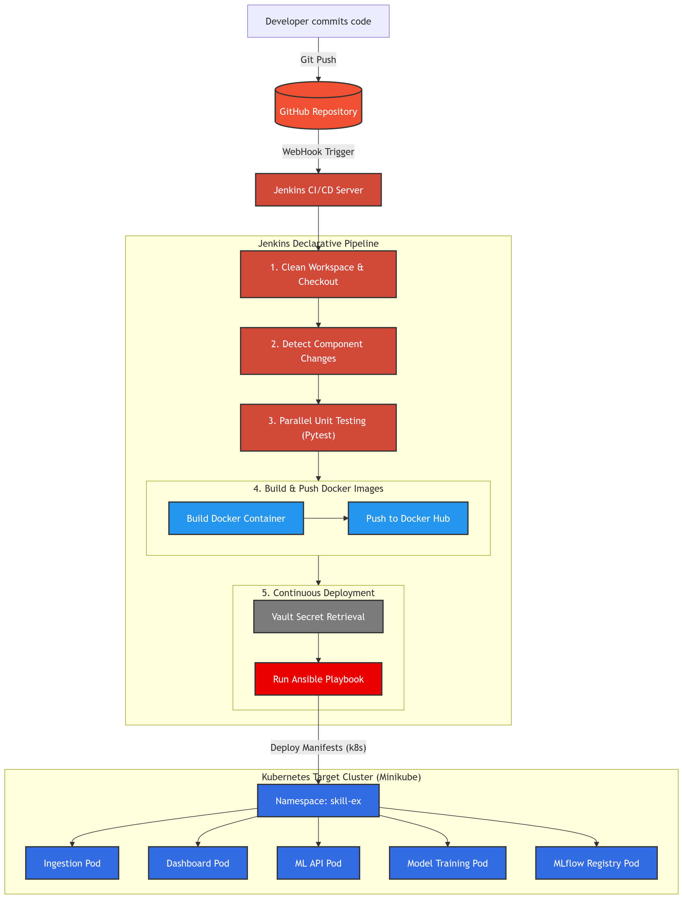
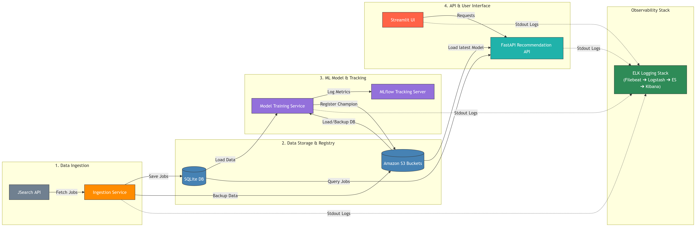

# Skill-Ex: AI Career Radar 

Skill-Ex is an MLOps-ready, high-performance platform designed for tech skill extraction, personalized job recommendation, and real-time market trend analysis.

---

##  Project Structure

The project is structured as a decoupled set of microservices with centralized shared core logic, automated Kubernetes deployment configuration, and a continuous integration pipeline:

```
├── microservices/
│   ├── ingestion/             # API Ingestion & S3/SQLite Syncing
│   ├── model_training/        # ML Model Training & MLflow Tracking
│   ├── ml/
│   │   └── recommendation_api/# FastAPI Inference Service (Job Recommendation Engine)
│   ├── dashboard/             # Streamlit Dashboard UI
│   └── shared/                # Shared Core Logic (Interfaces, DB Repository, Config, Utilities)
├── k8s/                       # Kubernetes Manifests (Ingestion, Dashboard, ML-API, MLflow, Model-Training)
├── ansible/                   # Ansible Playbooks and Roles for Automated Secure Deployments
├── elk/                       # Elasticsearch, Logstash, Kibana (ELK Stack) Logging Configuration
├── scripts/                   # Helper Automation Scripts & Local Orchestration Tools
└── Jenkinsfile                # Jenkins CI/CD Declarative Pipeline
```

---



##  CI/CD and Automated Deployment (Jenkins & Ansible)

The Skill-Ex platform is automated using **Jenkins** for continuous integration and **Ansible** for secure continuous delivery to **Kubernetes**.



###  Jenkins CI/CD Pipeline
Every push to the GitHub repository automatically triggers the declarative Jenkins pipeline (`Jenkinsfile`), which performs the following stages:

1. **Clean Workspace & SCM Checkout**: Cleans untracked/build artifacts (`git clean -fdx`) and checkouts the latest commit.
2. **Detect Component Changes**: Analyzes which microservice folders were modified to conditionally trigger builds (currently configured to trigger all builds for robust deployment).
3. **Parallel Unit Testing**: Executes automated test suites (e.g., Streamlit dashboard tests via `pytest`) in parallel to ensure build stability.
4. **Docker Image Build & Push**: Automatically containerizes and pushes stable images for all microservices (`ingestion`, `dashboard`, `ml-api`, `model-training`, `mlflow`) to Docker Hub.
5. **Ansible Kubernetes Deployment**: Decrypts secure Ansible Vault secrets securely using Jenkins Credentials (`ANSIBLE_VAULT_PASSWORD`) and executes the Ansible playbooks to update the Kubernetes cluster.

###  Kubernetes & Ansible Infrastructure Deployment
All services are deployed into a Kubernetes cluster (e.g., Minikube) under the `skill-ex` namespace.
- **Kubernetes Manifests**: Located under `k8s/` (declarative namespace, service accounts, volumes, deployments, and services).
- **Ansible Deployment Automation**: Playbooks and inventory are structured under `ansible/`.
- **Manual Ansible Execution**: To trigger deployment manually with the vault credentials:
  ```bash
  ansible-playbook -i ansible/inventory.ini ansible/deploy.yml --vault-password-file .vault_pass
  ```

---

##  Prerequisites & Setup

### Prerequisites
- Python 3.12+
- Virtual environment (`venv`)
- Amazon S3 bucket (for raw and processed data backups, and model artifacts)
- RapidAPI Key (for JSearch API access)
- Docker & Kubernetes (Minikube)

### Setup Instructions

1. **Initialize Virtual Environment**:
   ```bash
   python3 -m venv venv
   source venv/bin/activate
   pip install -r requirements.txt
   ```

2. **Environment Variables**:
   Create a `.env` file in the project root directory:
   ```env
   RAPIDAPI_KEY=your_rapidapi_key_here
   AWS_ACCESS_KEY_ID=your_aws_access_key_here
   AWS_SECRET_ACCESS_KEY=your_aws_secret_key_here
   AWS_RAW_BUCKET=amzn-s3-raw-bucket-skillex
   AWS_PROCESSED_BUCKET=amzn-s3-processed-bucket-skillex
   ```

---

##  Key Features

- **Microservices Architecture**: Completely independent, decoupled services for Ingestion, Model Training, Recommendation API, and Streamlit Dashboard.
- **Automated Pipeline**: Robust continuous integration, unit testing, and Docker/Kubernetes CD pipeline managed by **Jenkins** and **Ansible**.
- **Skill Extraction**: Optimized regex-based skill extraction covering 150+ modern tech skill terms.
- **Job Recommendations**: TF-IDF and content-based job recommendation engine with dynamic skill gap analysis.
- **Market Trends**: Time-series analytical model showcasing penetration and growth/momentum metrics for tech skills.
- **Clean Code & SOLID Design**: Adheres to strict SOLID design patterns with shared data repository and storage abstraction layers.